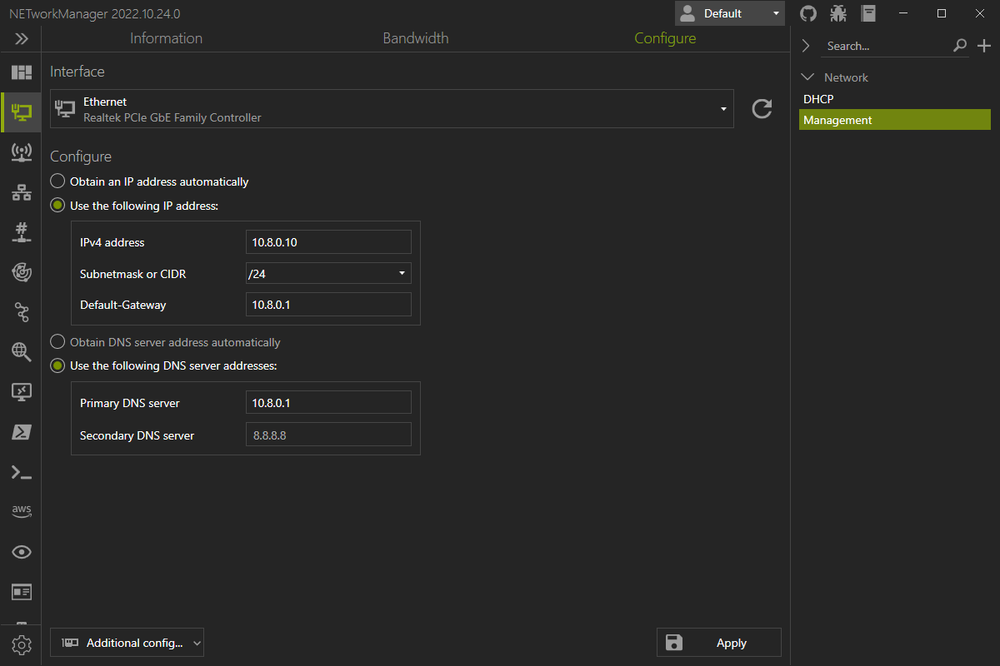

# Network Interface

In **Network Interface** you can see all network adapters of the computer with the most important information (like IP addresses, DNS servers etc.). The bandwidth of the connected network adapter can be monitored and the configuration such as IP address or DNS server can be changed via profiles.

## Information

On the **Information** tab, you can see all the important details of the selected network adapter such as the configured IP addresses, DNS servers, MAC address, and more. If information such as IPv6 configuration is not available, it is hidden in the view.

:::note

In addition, further actions can be performed using the buttons at the bottom left:

- **Network connections...** - Opens the `Control Panel > Network and Internet > Network Connections` window.
- **IP Scanner** - Opens the [IP Scanner](./ip-scanner) tool and forwards the IPv4 address and subnetmask of the _selected_ network adapter.
- **Flush DNS cache** - Flush the DNS cache (`ipconfig /flushdns`).
- **Release & Renew**
  - **IPv4**
    - **Release & Renew** - Releases the current IPv4 addresses obtained via DHCP and renews them via DHCP for the _selected_ network adapter that is configured to automatically obtain an IPv4 address (`ipconfig /release && ipconfig /renew <ADAPTER>`).
    - **Release** - Releases the current IPv4 addresses obtained via DHCP for the _selected_ network adapter that is configured to automatically obtain an IPv4 address (`ipconfig /release <ADAPTER>`).
    - **Renew** - Renews the current IPv4 address via DHCP for the _selected_ network adapter that is configured to automatically obtain an IPv4 address (`ipconfig /renew <ADAPTER>`).
  - **IPv6**
    - **Release & Renew** - Releases the current IPv6 addresses obtained via DHCPv6 and renews them via DHCPv6 for the _selected_ adapter that ist configured to automatically obtain an IPv6 address (`ipconfig /release6 && ipconfig /renew6 <ADAPTER>`).
    - **Release** - Releases the current IPv6 addresses obtained via DHCPv6 for the _selected_ network adapter that is configured to automatically obtain an IPv6 address (`ipconfig /release6 <ADAPTER>`).
    - **Renew** - Renews the current IPv6 address via DHCPv6 for the _selected_ network adapter that is configured to automatically obtain an IPv6 address (`ipconfig /renew6 <ADAPTER>`).

:::

:::note

Right-click on the result to copy or export the information.

:::

## Bandwidth

On the **Bandwidth** tab, you can monitor the currently used bandwidth of the selected network adapter.

You can see the current download and upload speed in bit/s (B/s). Depending on the bandwidth used, it is automatically changed to KBit/s (KB/s), MBit/s (MB/s) or GBit/s (GB/s). It also shows since when the bandwidth has been measured and how much has been downloaded and uploaded since then.

:::note

If you switch to another tool, monitoring will stop and when you switch back, the statistics will be reset and monitoring will continue.

:::

## Configure

On the **Configure** tab, you can change the configuration of the selected network adapter. In order to change the settings, the network adapter must be connected.

The options you can set correspond to the network adapter properties `Internetprotokoll, Version 4 (TCP/IPv4) Properties` in the `Control Panel > Network and Internet > Network Connections`. These are explained in the [profiles section](#profile). Clicking the **Apply** button will launch an elevated PowerShell to configure the network adapter.

In addition, further actions can be performed using the buttons at the bottom left:

- **Additional config...**
  - **Add IPv4 address...** - Opens a dialog to add an IPv4 address with a subnet mask or CIDR to the selected network adapter.
  - **Remove IPv4 addres...** - Opens a dialog where you can select an IPv4 address to remove from the selected network adapter.

:::note

You may need to confirm a Windows UAC dialog to make changes to the network interface.

:::

## Profile

### Obtain an IP address automatically

Obtain an IP address automatically from a DHCP server for the selected network adapter.

**Type:** `Boolean`

**Default:** `Enabled`

:::note

If you select this option, the [Use the following IP address](#use-the-following-ip-address) option will be disabled.

:::

### Use the following IP address:

Configure a static IP address for the selected network adapter. See [IPv4 address](#ipv4-address), [Subnetmask or CIDR](#subnetmask-or-cidr) and [Default-Gateway](#default-gateway) options below for more information.

**Type:** `Boolean`

**Default:** `Disabled`

:::note

If you select this option, the [Obtain an IP address automatically](#obtain-an-ip-address-automatically) option will be disabled.

:::

### IPv4 address

Static IPv4 address for the selected network adapter.

**Type:** `String`

**Default:** `Empty`

**Example:** `192.168.178.20`

### Subnetmask or CIDR

Subnet mask or CIDR for the selected network adapter.

**Type:** `String`

**Default:** `Empty`

**Example:**

- `/24`
- `255.255.255.0`

### Default-Gateway

Default gateway for the selected network adapter.

**Type:** `String`

**Default:** `Empty`

**Example:** `192.168.178.1`

### Obtain DNS server address automatically

Obtain DNS server address automatically from a DHCP server for the selected network adapter.

**Type:** `Boolean`

**Default:** `Enabled`

:::note

If you select this option, the [Use the following DNS server addresses](#use-the-following-dns-server-addresses) option will be disabled.

:::

### Use the following DNS server addresses:

Configure static DNS server addresses for the selected network adapter. See [Primary DNS server](#primary-dns-server) and [Secondary DNS server](#secondary-dns-server) options below for more information.

**Type:** `Boolean`

**Default:** `Disabled`

:::note

If you select this option, the [Obtain DNS server address automatically](#obtain-dns-server-address-automatically) option will be disabled.

:::

### Primary DNS server

Primary DNS server for the selected network adapter.

**Type:** `String`

**Default:** `Empty`

**Example:** `1.1.1.1`

### Secondary DNS server

Secondary DNS server for the selected network adapter.

**Type:** `String`

**Default:** `Empty`

**Example:** `1.0.0.1`
