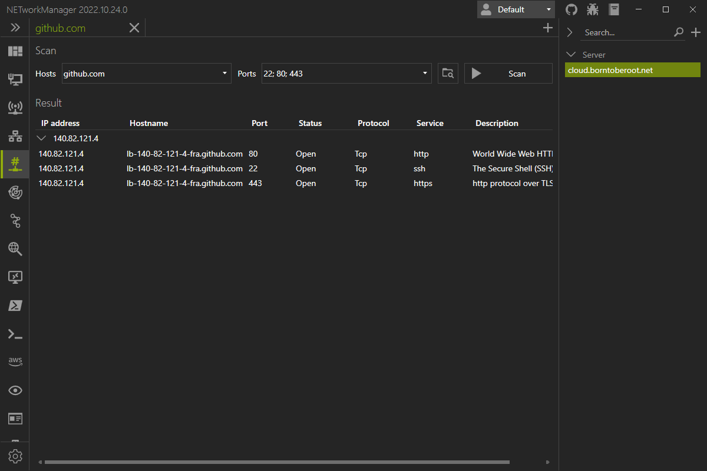

# Port Scanner

With the **Port Scanner** you can scan for open `tcp` ports on one or multiple hosts to determine which services are running.

Example inputs:

| Host                             | Description                                                                               |
| -------------------------------- | ----------------------------------------------------------------------------------------- |
| `10.0.0.1`                       | Single IP address (`10.0.0.1`)                                                            |
| `10.0.0.100 - 10.0.0.199`        | All IP addresses in a given range (`10.0.0.100`, `10.0.0.101`, ..., `10.0.0.199`)         |
| `10.0.0.0/23`                    | All IP addresses in a subnet (`10.0.0.0`, ..., `10.0.1.255`)                              |
| `10.0.0.0/255.255.254.0`         | All IP addresses in a subnet (`10.0.0.0`, ..., `10.0.1.255`)                              |
| `10.0.[0-9,20].[1-2]`            | Multipe IP address like (`10.0.0.1`, `10.0.0.2`, `10.0.1.1`, ...,`10.0.9.2`, `10.0.20.1`) |
| `borntoberoot.net`               | Single IP address resolved from a host (`10.0.0.1`)                                       |
| `borntoberoot.net/24`            | All IP addresses in a subnet resolved from a host (`10.0.0.0`, ..., `10.0.0.255`)         |
| `borntoberoot.net/255.255.255.0` | All IP addresses in a subnet resolved from a host (`10.0.0.0`, ..., `10.0.0.255`)         |

| Port                  | Description                                        |
| --------------------- | -------------------------------------------------- |
| `1-1024`              | All ports in a given range (`1`, `2`, ..., `1024`) |
| `80; 443; 8080; 8443` | Multiple ports like (`80`, `443`, `8080`, `8443`)  |

:::note

Multiple inputs can be combined with a semicolon (`;`).

Example: `10.0.0.0/24; 10.0.[10-20]1` or `1-1024; 8080; 8443`

:::

:::note

Right-click on the result to copy or export the information.

:::

## Profile

### Inherit host from general

Inherit the host from the general settings.

**Type:** `Boolean`

**Default:** `Enabled`

:::note

If this option is enabled, the [Host](#host) is overwritten by the host from the general settings and the [Host](#host) is disabled.

:::

### Host

Hostname or IP range to scan for open ports.

**Type:** `String`

**Default:** `Empty`

**Example:**

- `server-01.borntoberoot.net`
- `1.1.1.1; 1.0.0.1`
- `10.0.0.0/24`

:::note

See also the [Port Scanner](#port-scanner) example inputs for more information about the supported host formats.

:::

### Ports

TCP ports to scan each host for.

**Type:** `String`

**Default:** `Empty`

**Example:**

- `1-1024`
- `80; 443; 8080; 8443`

:::note

See also the [Port Scanner](#port-scanner) example inputs for more information about the supported port formats.

:::

## Settings

### Port profiles

List of common `tcp` ports to scan for.

**Type:** `List<NETworkManager.Models.Network.PortProfileInfo>`

**Default:**

| Name              | Ports                               |
| ----------------- | ----------------------------------- |
| DNS (via TCP)     | `53`                                |
| NTP (via TCP)     | `123`                               |
| Webserver         | `80; 443`                           |
| Webserver (Other) | `80; 443; 8080; 8443`               |
| Remote access     | `22; 23; 3389; 5900`                |
| Mailserver        | `25; 110; 143; 465; 587; 993; 995`  |
| Filetransfer      | `20-21; 22; 989-990; 2049`          |
| Database          | `1433-1434; 1521; 1830; 3306; 5432` |
| SMB               | `139; 445`                          |
| LDAP              | `389; 636`                          |
| HTTP proxy        | `3128`                              |

### Show closed ports

Show closed ports in the result list.

**Type:** `Boolean`

**Default:** `Disabled`

### Timeout (ms)

Timeout in milliseconds after which a port is considered closed / timed out.

**Type:** `Integer` [Min `100`, Max `15000`]

**Default:** `4000`

### Resolve hostname

Resolve the hostname for given IP addresses.

**Type:** `Boolean`

**Default:** `Enabled`

### Max. concurrent host threads

Maximum number of threads used to scan hosts (1 thread = 1 host).

**Type:** `Integer` [Min `1`, Max `10`]

**Default:** `5`

:::warning

Too many simultaneous requests may be blocked by a firewall. You can reduce the number of threads to avoid this, but this will increase the scan time.

Too many threads can also cause performance problems on the device.

:::

:::note

This setting only change the maximum number of concurrently executed threads per host scan. See also the [General](../settings/general#threadpool-additional-min-threads) settings to configure the application wide thread pool.

:::

### Max. concurrent port threads

Maximum number of threads used to scan for ports for each host (1 thread = 1 port per host).

**Type:** `Integer` [Min `1`, Max `512`]

**Default:** `256`

:::warning

Too many simultaneous requests may be blocked by a firewall. You can reduce the number of threads to avoid this, but this will increase the scan time.

Too many threads can also cause performance problems on the device.

:::

:::note

This setting only change the maximum number of concurrently executed threads per host scan. See also the [General](../settings/general#threadpool-additional-min-threads) settings to configure the application wide thread pool.

:::
