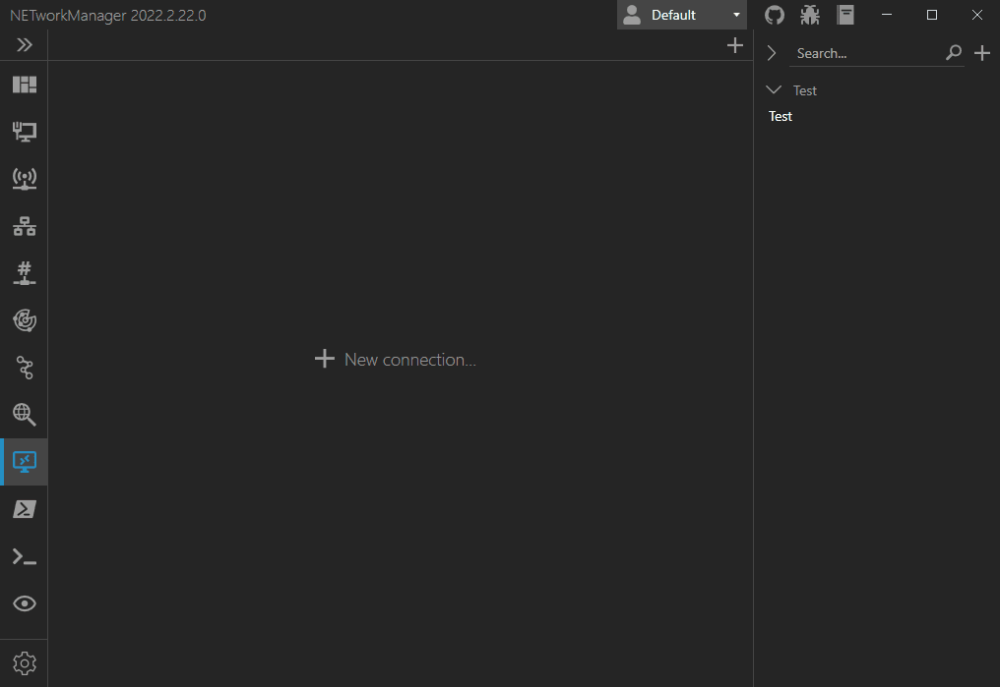

# Frequently Asked Questions

The documentation and the FAQ are not complete yet! Feel free to ask questions on [GitHub Discussions](https://github.com/BornToBeRoot/NETworkManager/discussions).

## How to contribute or report an issue?

Read the [README](https://github.com/BornToBeRoot/NETworkManager/blob/main/README.md#-contributing){:target="\_blank"} and follow the instructions there.

## Where are files stored?

The setup installs the application in the following path: `%ProgramFiles%\NETworkManager`
You can run the archive and portable version from anywhere.

Profiles, settings and themes are stored in the following folders:

\> 2022.12.22.0
{: .label .label-purple }

| File(s)  | Setup or Archiv                                     | Portable                  |
| -------- | --------------------------------------------------- | ------------------------- |
| Profiles | `%UserProfile%\Documents\NETworkManager\Profiles\*` | `<APP_FOLDER>\Profiles\*` |
| Settings | `%UserProfile%\Documents\NETworkManager\Settings\*` | `<APP_FOLDER>\Settings\*` |
| Themes   | `<APP_FOLDER>\Themes\*`                             | `<APP_FOLDER>\Themes\*`   |

<= 2022.12.22.0
{: .label .label-purple }

| File(s)  | Setup or Archiv                       | Portable                  |
| -------- | ------------------------------------- | ------------------------- |
| Profiles | `%AppData%\NETworkManager\Profiles\*` | `<APP_FOLDER>\Profiles\*` |
| Settings | `%AppData%\NETworkManager\Settings\*` | `<APP_FOLDER>\Settings\*` |
| Themes   | `<APP_FOLDER>\Themes\*`               | `<APP_FOLDER>\Themes\*`   |

{: .note }
It is recommended to backup the above files on a regular basis.

In addition, some files and settings, as well as the cache, are stored in the following locations:

| File(s)             | Setup, Archiv and Portable                                           |
| ------------------- | -------------------------------------------------------------------- |
| Local settings      | `%LocalAppData%\NETworkManager\NETworkManager_Url_<RANDOM_STRING>\*` |
| Log                 | `%LocalAppData%\NETworkManager\NETworkManager.log`                   |
| PowerShell profiles | `HKCU:\Console\<PATH_OF_CONSOLE>`                                    |
| PuTTY log           | `%LocalAppData%\NETworkManager\PuTTY_Log\*`                          |
| PuTTY profile       | `HKCU:\Software\SimonTatham\PuTTY\Sessions\NETworkManager`           |
| WebConsole cache    | `%LocalAppData%\NETworkManager\WebConsole_Cache\*`                   |

{: .note }
Since version `2022.12.22.0` the local settings are no longer used.

## How to build the project?

The project can be build with Visual Studio or with a PowerShell script. More details and the requirements can be found in the [README](https://github.com/BornToBeRoot/NETworkManager/blob/main/README.md#-build){:target="\_blank"}.

## Profile, groups and settings priority

Settings in profiles overwrite group settings. Group settings overwrite global settings.

Inheritance is: `General Settings > Group settings > Profile settings`

## How does the profile encryption work?

Profile files are encrypted on disk using [AES](https://docs.microsoft.com/de-de/dotnet/api/system.security.cryptography.aes?view=net-6.0){:target="\_blank"} with a key size of 256 bits and a block size of 128 bits in CBC mode. The encryption key is derived from a master password using [Rfc2898DeriveBytes](https://docs.microsoft.com/en-US/dotnet/api/system.security.cryptography.rfc2898derivebytes?view=net-5.0){:target="\_blank"} (PBKDF2) with 1,000,000 iterations. At runtime, passwords are stored as [SecureString](https://docs.microsoft.com/en-US/dotnet/api/system.security.securestring?view=net-5.0){:target="\_blank"} once the profile file is loaded. For some functions, the password must be converted to a normal string and remains unencrypted in memory until the garbage collector cleans them up. If you found a security issue, you can report it [here](https://github.com/BornToBeRoot/NETworkManager/security/policy){:target="\_blank"}!

## How to enable profile file encryption?

Open the settings and go to the profile section. Right click on the profile file you want to encrypt. Select `Encryption...` > `Enable encryption...` and set your master password.

## How to change the master password of an encrypted profile file?

Open the settings and go to the profile section. Right click on an encrypted profile file. Select `Encryption...` > `Change Master Password...` and enter the current master password and a new master password.

## How to disable profile file encryption?

Open the settings and go to the profile section. Right click on an encrypted profile file. Select `Encryption...` > `Disable encryption...` and enter your master password.

