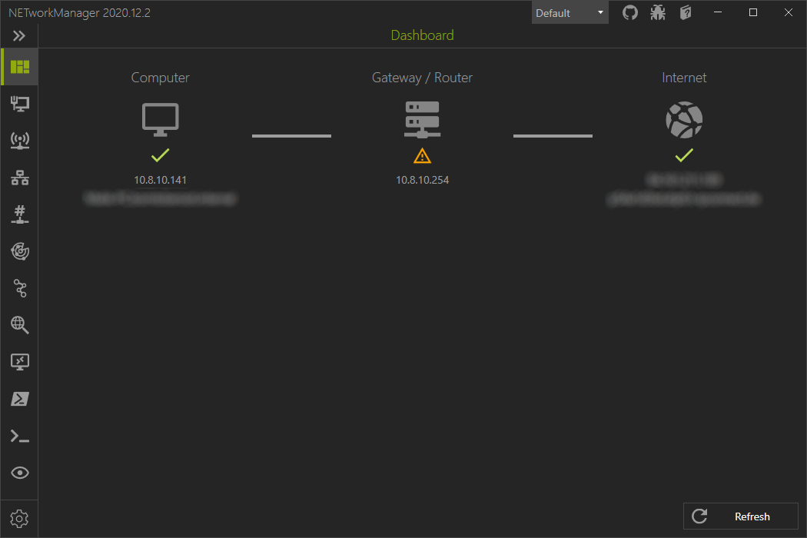

# Dashboard
The dashboard checks automatically and at every status change of the local network adapters (network cable plugged in, WLAN connected, etc.) if there is a connection to the Internet. 
First it checks if the local tcp/ip stack is available. Then the local IP address of the computer is determined based on the local routing. For this the IP address from the [Public ICMP test IP address](#public-icmp-test-ip-address) setting is used. If you have multiple connections to the Internet (e.g. Ethernet and WLAN) the one with the highest metric is used.

## Settings

### Public ICMP test IP address
During the connection test, a ping / ICMP packet is sent to this IP address to determine whether a host can be reached outside of your local network. It can be changed to any IP address as long as this IP address responds to ping / ICMP packets.

**Default:** `1.1.1.1`

### Public DNS test domain
Public domain name

**Default:** `one.one.one.one`

### Public DNS test IP address
Description...

**Default:** `1.1.1.1`

### Check public IP address
Description...

**Default** `Enabled`

### Use custom API
Description...
