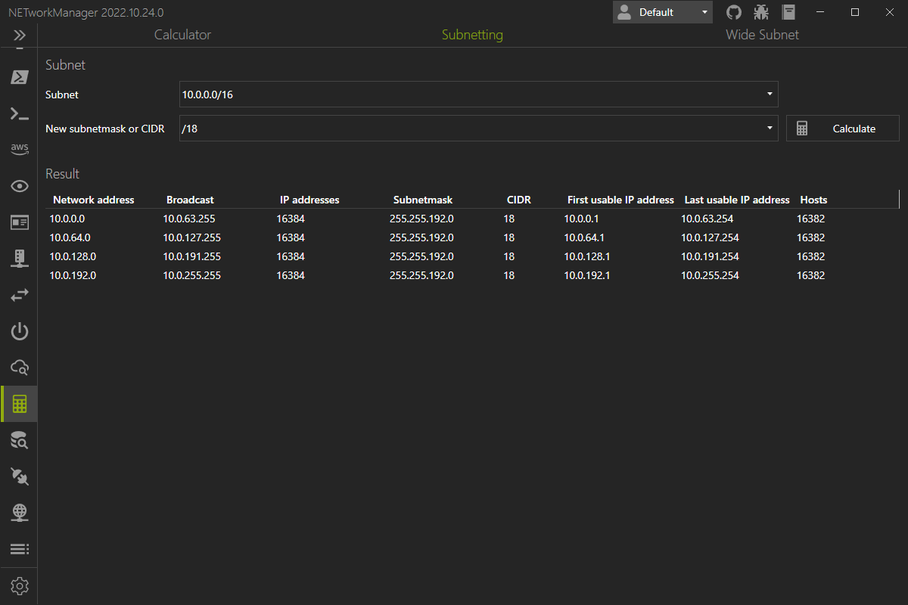

# Subnet Calculator

With the **Subnet Calculator** you can [calculate a subnet](#calculator), [split subnets](#subnetting) and create a [wide subnet](#wide-subnet). Both IPv4 and IPv6 are supported.

## Calculator

On the **Calculator** tab, you can calculate a subnet by entering the IP address and the subnet mask. The subnet mask can be entered in CIDR notation.

Example inputs:

- `10.0.0.0/16`
- `192.168.0.0/255.255.255.0`
- `2001:db8::/32`

{: .note}
Right-click on the result to copy the information.

## Subnetting

On the **Subnetting** tab, you can split a subnet into smaller subnets. The subnet mask can be entered in CIDR notation.

Example inputs:

| Subnet                      | New subnet mask   |
| --------------------------- | ----------------- |
| `10.0.0.0/16`               | `/18`             |
| `192.168.0.0/255.255.255.0` | `255.255.255.128` |
| `2001:db8::/32`             | `/48`             |

{: .note}
Right-click on the result to copy or export the information.

## Wide Subnet

On the **Wide Subnet** tab, you can create a wide subnet that includes both given subnets. The subnet mask can be entered in CIDR notation.

Example inputs:

| Subnet 1                    | Subnet 2         |
| --------------------------- | ---------------- |
| `10.0.0.0/16`               | `10.2.0.0/16`    |
| `192.168.0.0/255.255.255.0` | `192.168.4.0/23` |

{: .note}
IPv6 is not supported.

{: .note}
Right-click on the result to copy the information.
